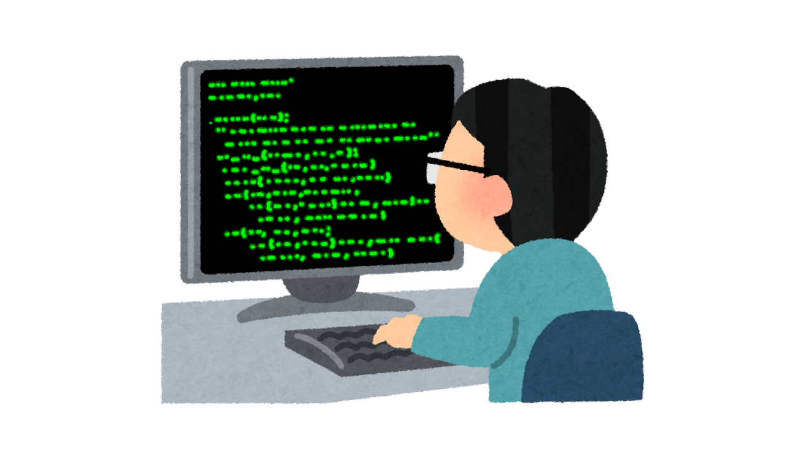
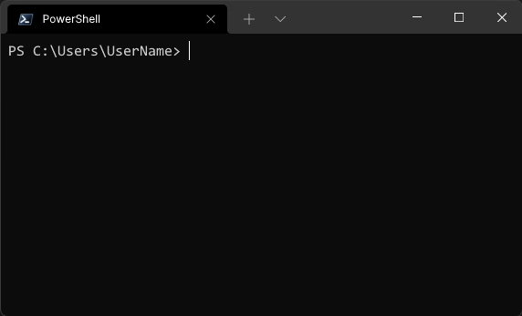
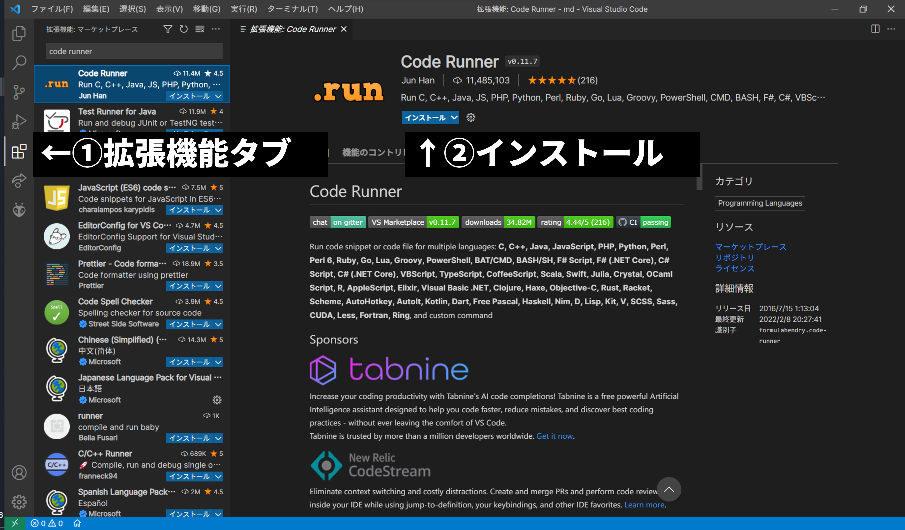
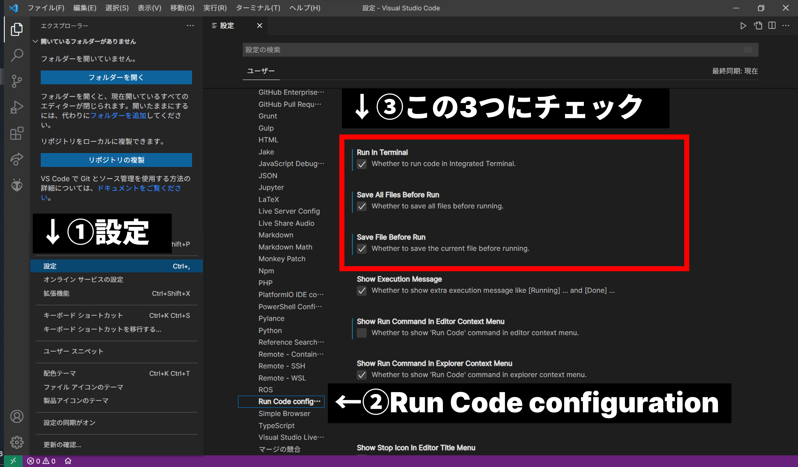

# C++講習 第0回 ~CLIと環境構築
## 今回の内容
- CLIの使い方
- 環境構築

プログラミングやそもそもコンピュータに慣れていない人が一通りC++を書けるようになるまでに必要な事項を全4回で載せていきます．2021年度に電装班を対象に行われた講習会を文章化したものです．

## CLIの使い方
### CLIとは
普段皆さんがよく見る画面にはアイコンやボタンが無数に並んでいます．これをGUI(Graphical User Interface)といいます．それに対し，アイコンやボタンを用いず，文字だけで操作する操作体型のことをCLI(Command Line Interface)と呼びます．エンジニアの人やハッカーの人が黒い画面に文字をカタカタ打ち込んでいる場面イメージするとわかりやすいでしょう．

開発を進めていく上で，GUIよりもCLIの方が便利に用いられることが多いです．例えばGUIで「〇〇というボタンをクリックして，△△をドラッグして…」という一連の動作をコマンド一行で実行できる，といったことがザラにあります．一度きりの動作ならGUIでもいいかもしれませんが，同じ作業を何回もするとなるとCLIの方が圧倒的に楽です．見かけこそ取っつきにくいかと思いますが，思ったよりずっと簡単にできているのでまずはここからマスターしていきましょう！

### 「ターミナル」を開く
CLIを扱うには，「ターミナル」というソフトを使います．Windowsの人は[Windows Terminal](https://www.microsoft.com/store/productId/9N0DX20HK701)をストアからダウンロードしてください．Macの場合はもとからインストールされているのを開いてください．

以下はWindowsの画面で説明します．MacとWindowsでコマンドが異なる場合は表記します．

Windows Terminalを開いた画面の例を以下に示します．


### フォルダとディレクトリ
これを理解するにはまず，ディレクトリ構造を理解する必要があります．  
皆さんは「フォルダ」を作ったことがあると思います(ない人は，デスクトップを右クリックして新しいフォルダーを作ってみてください)．ディレクトリとはフォルダのことそのものです．また，フォルダの中にフォルダを作ると階層になります．このように，ディレクトリは階層構造にすることができます．

すべてのディレクトリは階層構造になっています．以下にWindowsとMacのそれぞれの例を示します．

```
Windows
C:/
├Program Files
│   ︙
│   └インストールしたソフトのデータなど
├Users
│   └UserName
│       ︙
│       ├Desktop - 課題.docx
│       ├Documents
│       ├Music
│       └Pictures
├Windows
│   ︙
│   └システムファイルなど
├...
```
```
Mac
/
├Application
│   ︙
│   └インストールしたソフトのデータなど
├System
│   ︙
│   └システムファイルなど
├Users
│   └UserName
│       ︙
│       ├Desktop - 課題.docx
│       ├Documents
│       ├Music
│       └Pictures
├...
```
このように，Windowsでは`C:/`が，Macでは`/`を起点として多くのディレクトリが階層状に連なっています．パソコンのデータはすべてディレクトリ構造で保存されているということです．

ここで，すべての根幹となるディレクトリ(Windowsでは`C:\`が，Macでは`/`)を**ルートディレクトリ**と呼び，自分のユーザー名のディレクトリ(この例ではUserName)を**ホームディレクトリ**と呼びます．

### 絶対パスと相対パス
ここで「パス」というものを理解しましょう．パソコン上でどこにファイルが保存されているかを示すとき，どう表すのがよいでしょうか．例えば，上の例でデスクトップに保存されている`課題.docx`というファイルを指し示したいとき，ルートディレクトリからのディレクトリのたどり方を示してあげればそのファイルに辿り着けそうです．以下にそれぞれのOSでの書き方を示します．
```
Windows
C:/Users/UserName/Desktop/課題.docx
```
```
Mac
/Users/UserName/Desktop/課題.docx
```
このように，ルートディレクトリからのディレクトリのたどり方を書き下したものを**絶対パス**と呼びます．ディレクトリの区切り記号にはスラッシュを`/`使うことを覚えておきましょう．(Windowsでは逆スラッシュ`\`で表示されることが多いですが，スラッシュでも問題なく使うことができるので今後はスラッシュ`/`で統一します)

では，相対パスとはなんでしょうか．これは，ある特定のディレクトリから別のディレクトリまでのディレクトリのたどり方を書き下したものです．例えば，上の例で**UserNameに対する課題.docxの相対パス**は
```
/Desktop/課題.docx
```
または
```
./Desktop/課題.docx
```
と書けます．また，**Desktopに対してUsersの相対パス**は
```
../../
```
と書きます．`../`は「一つ上の階層」という意味です．覚えておきましょう．また，この他に**ホームディレクトリを半角チルダ`~`で表すことがあります**．

### コマンドの使い方
ディレクトリを理解したところでターミナルを見てみましょう．カーソルの左側にパスが表示されているのがわかると思います．これは**カレントディレクトリ**といい，今自分がいるディレクトリを表しています．打ち込むコマンドは基本的にカレントディレクトリのファイルに対して作用します．

さて，それでは早速コマンドを使ってみましょう．ターミナルに
```
cd /
```
と入力してみてください．  
カレントディレクトリの表示が変わったと思います．`cd`というコマンドは，**「カレントディレクトリを移動するコマンド**です．スペースのあとの`/`はルートディレクトリを表す絶対パスなので，今はルートディレクトリに移動したことになります．これはコマンドの**引数**になっています．それでは，ここで課題です．
```
cdコマンドを利用して，カレントディレクトリをデスクトップに変更してください．
```
次に`mkdir`というコマンドを紹介します．`mkdir`の書式は
```
mkdir [ディレクトリ名]
```
となっており，カレントディレクトリの下に指定したディレクトリ名のディレクトリを作成することができます．
```
mkdirコマンドを使って，デスクトップにpracticeというディレクトリを作成してください．
```

## 環境構築
CLIの操作がわかったところで，C++を実行する環境をCLIで構築していきたいと思います．
### パッケージマネージャのインストール
スマホにアプリを入れるとき，アプリストアを使ってインストールすると思います．**パッケージマネージャ**は，CLIで使えるパソコン用のアプリストアのようなものです．コマンド1行でソフトをインストールできるので，非常に楽に環境構築ができます．以下のコマンドをターミナルにコピペしてください．**Windowsの人はWindows Terminalを1回閉じて，管理者として実行し直してください．スタートメニューのWindows Terminalを右クリックすると管理者として実行できます．**

Windows
```bat
Set-ExecutionPolicy Bypass -Scope Process -Force; [System.Net.ServicePointManager]::SecurityProtocol = [System.Net.ServicePointManager]::SecurityProtocol -bor 3072; iex ((New-Object System.Net.WebClient).DownloadString('https://community.chocolatey.org/install.ps1'))

```
Mac
```sh
/bin/bash -c "$(curl -fsSL https://raw.githubusercontent.com/Homebrew/install/HEAD/install.sh)"

```
ここでは，Windowsでは[Chocolatey](https://chocolatey.org/)，Macでは[brew](https://brew.sh/)というパッケージマネージャを使います．

### C++コンパイラや必須ツールのインストール
コンパイラに関しては後述します．Windowsの方は以下のコマンドをコピペしてください．
```bat
choco install mingw
choco install gsudo

```
Macの方はOSにインストール済みなので操作は不要です．

ターミナルを一度閉じてからもう一度開いて，
```bat
g++ -v
```
と入力し，バージョンが表示されれば成功です．

### エディタのインストール
ここではMicrosoft Visual Studio Code(以下VSCode)というソフトを例に説明していきます．[こちらのサイト](https://code.visualstudio.com/)からお使いの環境に合わせてインストールしてください．他のエディタがよいという人は各自でインストールしてください．

### 拡張機能のインストール
拡張機能タブからCode Runnerと検索して，拡張機能をインストールしてください．


### 拡張機能の設定
VSCodeの設定を開き，左のカラムから「Run Code configuration」を選択して，少し下にスクロールして「Run in Terminal」「Save All Files Before Run」「Save File Before Run」にチェックを入れてください．



[ホーム](index.md)　　　[第1回](1.md)