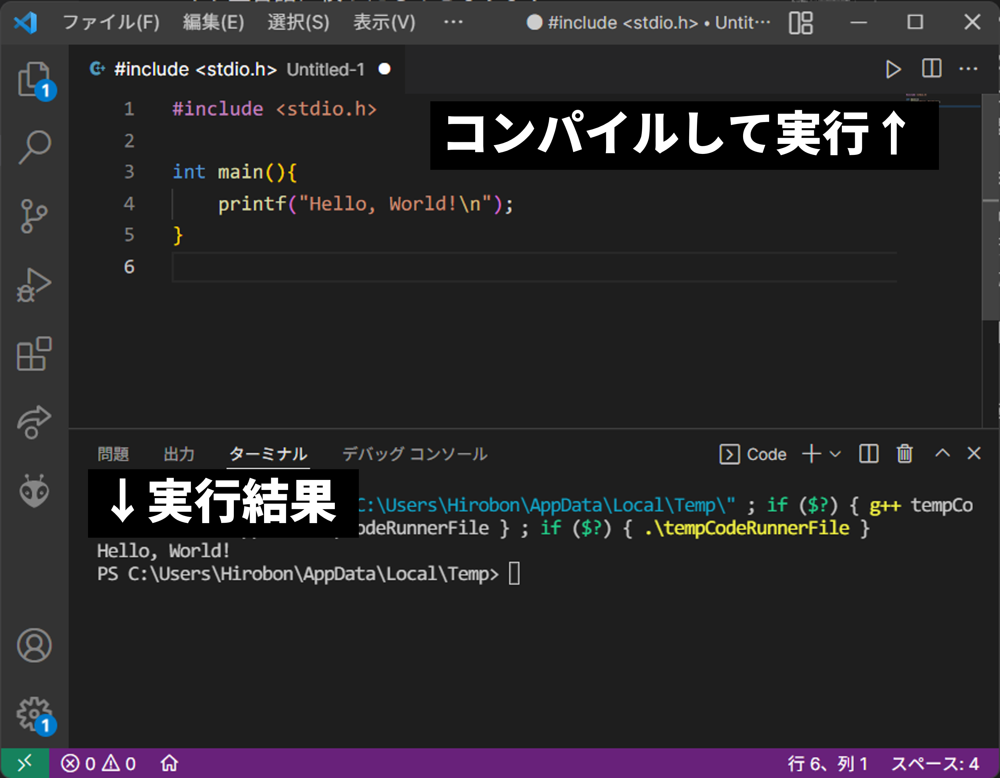

# C++講習 第1回 ~入門
## プログラミング言語とは
マイコンやパソコンなどのコンピュータはすべて共通の言語でやり取りしています．**「機械語」** と呼ばれるものです．機械語は0と1の2種類，すなわち2進数のみを用いて表現され，コンピュータ内部で超高速に処理されます．しかし，人間がこれを読んだり，書いたりすることは~~一部の猛者を除いて~~不可能です．そこで登場するのが**プログラミング言語**です．プログラミング言語は人間がロジックを組むのにわかりやすいように作られており，自然言語と同様にさまざまな種類があります．プログラマーはそれぞれの言語を用途に合わせて使い分けています．ロ技研では主にC++を用いています．

## 機械語↔プログラミング言語の変換
プログラミング言語で書かれたプログラムは，機械が実行できるように機械語に変換する必要があります．変換の手法は2種類あり，**「インタプリタ」** を用いるものと **「コンパイラ」** を用いるものがあります．それぞれの特徴を簡単にまとめます．

```mermaid
graph TD;
プログラミング言語 --> 変換器(インタプリタ/コンパイラ) --> 機械語
```

|           |インタプリタ型言語         |コンパイラ型言語|
|---|---|---|
|言語の例   |Python, JavaScript, PHPなど|C, C++, Javaなど|
|実行方式   |1行ずつ機械語に変換        |プログラム全体を機械語に変換|
|メリット   |プログラムが完成していなくても実行できる<br>電卓的な使い方ができる|すべて機械語に変換されてから実行するので軽い|
|デメリット|コンパイラ型に比べて動作が重い|完成していないとコンパイルできない|

C++はコンパイラ型言語であるため，以降の説明はコンパイラ型言語に絞ったものとなります．

## コンパイルとは
上記で説明したとおり，プログラミング言語を機械語に変換する工程のことを **「コンパイル」** と呼び，それを実行することを **「コンパイルする」** または **「ビルドする」** といいます．
### Code Runnerを用いたコンパイル
VSCodeのCode Runnerは，右上の再生ボタンをクリックすることでコンパイルから実行までを行ってくれます．再生ボタンが表示されない場合は，第0回の拡張機能の設定を見直してください．


## Hello, worldしよう！
まず，以下の内容で`.cpp`ファイルを作成して，再生ボタンを押してください．

```cpp
#include <stdio.h>

int main(){
    printf("Hello, World!\n");
}
```
コンパイルして実行したとき，ターミナルに`Hello, World!`と表示されれば成功です．

### Tips Windowsで実行結果が文字化けする
ターミナルに
```bat
chcp 65001
```
と入力してエンターを押してみてください．その後，もう一度実行してみてください．

## 学習の進め方
ここからサンプルコードが多数出てきますが，**コピペをせずに自分の手で入力することを強く勧めます．** 理由として，
- 自分で入力することで "プログラミングのノリ" を体感することができる
- 自分の入力によって生じたミスで，ミスしやすいところを覚える
- これから自分で全部書いていく下地ができる

といったことが挙げられます．すべてお手本通りやったのにうまくいかない，といった場合にはコピペしてチェックするのも有効ですが，あくまでベースは皆さんなのですから，コードを手打ちすることを強く勧めます．

また，以下に制御班の先輩方が勧める参考図書を載せておきます．各自自分にあったものを購入したり，大学の図書館で借りたりしてもよいと思います．
- [Cの絵本](https://www.amazon.co.jp/dp/479815038X)
- [C++の絵本](https://www.amazon.co.jp/dp/4798151904)
- [猫でもわかるC++プログラミング](https://www.amazon.co.jp/dp/4797372796)
- [新・明解C++入門編](https://www.amazon.co.jp/dp/4797394633)
- [やさしいC++ 第5版](https://www.amazon.co.jp/dp/4797392592)

[第0回](0.md)　　　[ホーム](index.md)　　　[第2回](2.md)