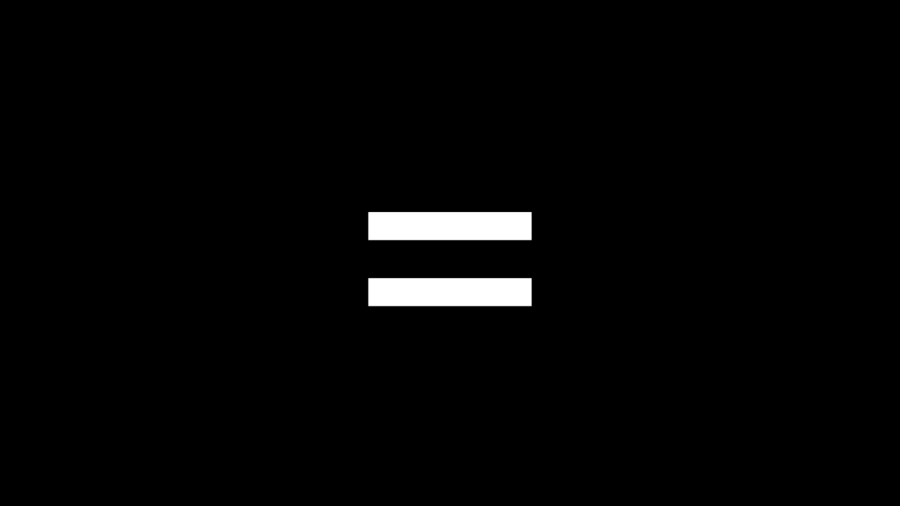

# C++講習 第2回 ~変数，演算子，制御文
## 基本形
まずは例を見てみましょう．
```c++
#include <stdio.h>
int main(void){
    ︙
    処理
    ︙
}
```
C++の基本形はこのようになっていて，mainの中カッコの中が**上から順に1度だけ実行されます**．*上から順に1度だけ実行されます*．大事なことなので2回言いました．これを**逐次処理**と呼びます．基本中の基本なので必ず覚えておいてください．

### 問題
逐次処理とは何か，説明してください．


## 基本文法
### ブロック
プログラムにおいて，**中カッコ** `{}`  に囲まれている範囲を**ブロック**と呼びます．

### セミコロン
プログラム中に **セミコロン**  `;` がよく出てきますが，これは区切り記号のようなものです．変数や関数の宣言時や代入時など，あらゆる場面でセミコロンをつけます．これを忘れてエラーになることも多いので注意してくください．

### コメント
プログラム中にプログラムに影響を与えないコメントを挿入することができます．コメントは以下の2通りの書き方があります．
```cpp
//コメント
```
```cpp
/*
    コメント
*/
```
また，VSCodeでは範囲を選択して`Ctrl`+`/`を押すことで一括でコメントにすることができます．ある範囲や行をコメントにすることを **コメントアウトする** といい，メモのほか**デバッグ時に一時的にコードを無効化する**際にも用いられます．  
※**デバッグ**とは，バグ(プログラムの不具合)を究明して解消することをいいます．決してデバッ*ク*ではありません．

## 変数
変数とは，数や文字を入れる箱のようなものです．

  

まずは例を見てみましょう．
```cpp
#include <stdio.h>

int main(){
    int a; 
    a = 16;
    printf("%d\n", a);
}
```
上の例では，aという箱を生成し，その箱に16という値を代入し，それを表示しています．  

### 型
変数の中にどのような値を入れるかを予め指定しておく **型** というものがあります．以下はよく用いられる型の例です．

|型     |入る値    |
|---    |---       |
|int    |整数      |
|unsigned int|符号なし整数|
|float| 実数|
|char|文字，整数|
|bool|真偽値(True,False)|

### 宣言
箱を生成することを，**変数を宣言する** といいます．変数の宣言は，
```cpp
型 変数名;
```
として行います．

### 代入
宣言した変数に値を入れることを，**代入**といいます．代入は，
```cpp
変数名 = 値;
```
の形で行います．注意してほしいのが，**`=`は代入であって同値という意味ではない**ということです．**`=`は同値ではなく代入**．*`=`は同値ではなく代入*．一度声に出して読んでみてください．**せーの！「`=`は，同値ではなく，代入！！！！！」**




**これだけ強調しても間違える人が絶対に1人はいます．** くれぐれも注意してください．~~間違えた人には大きな声で「=は同値ではなく代入！」と叫びましょう~~ **`=`は同値ではなく代入**

#### 問題
(1) 以下にあてはまる語句を埋めよ．  
**`=`は(　A　)ではなく(　B　)．**

(2) C++において，`=`はどういう意味か説明してください．

### 初期化
宣言後最初の代入のことを**初期化**といいます．変数の宣言と初期化は，以下のように同時に行うこともできます．
```cpp
int a = 1;
```

### `printf`記法に関して
`printf`を用いると，様々な値を出力することができます．今後よく使っていくので，この書き方を覚えておいてください．
printfは，**フォーマット指定子**に従って値を展開し，それを出力します．フォーマット指定子には，以下のようなものがあります(一部)．

|指定子|出力|
|---|---|
|%d|整数|
|%f|実数|
|%c|文字|
|%s|文字列|

例えば，変数a, bの内容を整数，実数で表示したい場合，以下のようになります．
```cpp
printf("%d, %f\n", a, b);
```
また，`%4d`のように%とアルファベットの間に数字を入れると，桁数を指定することができます．また，`\n`は改行を表します．これがないと，同じ行に出力が表示されて結果が見づらくなってしまいます．

### 問題
変数を2つ用意し，それぞれに1, 2.4を代入して表示してください．

## 演算子
ここでは3種類の演算子を扱います．順番に見ていきましょう．

### 算術演算子
算術演算子は，四則演算をする演算子です．

|演算子|意味|算数表記|
|---|---|---|
|+|たす|+|
|-|ひく|-|
|*|かける|×|
|/|わる|÷|
|%|あまり|mod|

変数aに，bを10で割って3たした値を代入するには以下のようになります．
```cpp
a = b / 10 + 3;
```
また，cにdを5で割ったあまりを代入するには
```cpp
c = d % 5;
```
となります．

#### 複合代入演算子
計算と代入を同時に行う便利な演算子もあります．

|演算子|意味|
|---|---|
|+=|たして代入|
|-=|ひいて代入|
|*=|かけて代入|
|/=|わって代入|
|%=|あまりを代入|

例を見ると使い方がわかります．
```cpp
a = a + 2;  //これと
a += 2;     //これは同じ意味
```

#### インクリメント/デクリメント

|演算子|意味|名前|
|---|---|---|
|++|1たして代入|インクリメント|
|--|1ひいて代入|デクリメント|

```cpp
a = a + 1;  //これは
a++;        //こう書くこともできます

a = a + 1;  //これは
a--;        //こう書くこともできます
```

### 論理演算子
論理演算子は，論理計算をする演算子です．比較演算子と合わせて用いられます．意味は理工学部の皆さんであれば容易にわかると思います．

|演算子|意味|算数表記|
|---|---|---|
|&&|かつ|AND|
|!|でない|NOT|
|\|\||または|OR|

### 比較演算子
比較演算子は，値を比較する演算子です．

|演算子|意味|算数表記|
|---|---|---|
|>|より大きい|>|
|>=|以上|≧|
|**==**|**同値**|=|
|<=|以下|≦|
|<|より小さい|<|

先ほど~~嫌というほど~~強調した同値は`==`です．**くれぐれも間違えないように注意してください！**

### その他
他にもビット演算を行うビット演算子や三項演算子などもあります．ここでは扱いませんが，興味のある人は調べてみてください．

## 条件式
論理演算子と比較演算子を組み合わせて，条件式を作ることができます．ここでは例を出して考えてみましょう．

3が代入されているaという変数と7が代入されているbという変数があるとします．このとき，「aが5未満かつbが5以上」という条件式はこのように表されます．
```cpp
(a <= 5)&&(b > 5)
```
また，この条件式は満たしている，つまり真であるのでこの条件式の持つ値はtrue(1)となります．ここで重要なのが，**条件式は値をもつ**という点です．これを実感するために，以下のプログラムを考えてみてください．
```cpp
#include <stdio.h>

int main(){
    int a = 3;
    int b = 7;
    bool c;
    c = (a <= 5)&&(b > 5);
    printf("%d\n", c);
}
```
上のプログラムでは，先程考えた条件式の値をcというbool型の変数に代入しています．この結果はどうなるでしょうか？─そうですね，1になります．条件式が真だからです．

### 問題
(1) 上のサンプルの値や式を変えて，条件式が値をもつことを実感してください．

(2) 以下の条件式を日本語に，日本語を条件式になおしてください．

(i) `(a!=9)||(b>=3)`

(ii) `!(a%4 == 1)`

(iii) `!((b==0)||(a!=3))`

(iv) 「`a`が`1`でない」かつ「`b`が`3`以下」

(v) 「`a`が`3`未満」または「`a + b`が6以上」

<details><summary>▶解答</summary>

(i) `a`が`9`でない または `b` が3以上

(ii) `a`を`4`で割った余りが`1` でない

(iii) `b`が`0`または`a`が`3`でない でない

(iv) `(a != 1)&&(b <= 3)`

(v) `(a < 3)||(a + b >= 6)`

</details>


## 制御文
**制御文**を使うことで，プログラムの流れを変えることができます．これにより，逐次処理の中で条件分岐や繰り返しが実現できます．

### 条件分岐
**`if`文**を使うと，**条件分岐**を作ることができます．  


上のフローチャートは，以下のプログラムで表せます．

```cpp
if(bool){
    処理A
}else{
    処理B
}
```
ifのあとのカッコには`bool値`が入り，1(真)のとき`if`ブロック内の処理Aが，0(偽)のとき`else`ブロック内の処理Bが実行され，次に進みます．ここに条件式を入れることで，条件式のもつ値により条件分岐を実装することができます．`else`は必ずしも書く必要はありません．

`if`文は，**入れ子**にしたり，**連続**で書くこともできます．


```cpp
//入れ子の例
if(条件式1){
    if(条件式2){
        処理A
    }else{
        処理B
    }
    処理C
}
```


```cpp
//連続の例
if(条件式1){
    処理A
}else if(条件式2){
    処理B
}else if(条件式3){
    処理C
}else{
    処理D
}
```

### 条件繰り返し
**`while`文**を使うと，**条件繰り返し**を作ることができます．

  

上のフローチャートは，以下のプログラムで表せます．
```cpp
while(bool){
    処理A
}
```
whileのあとのカッコには`bool値`が入り，1(真)のとき処理Aが，0(偽)のとき次に進みます．処理Aが終わったあと，もう一度上に戻り`bool値`が0か1か判別します．ここに条件式を入れることで，条件式のもつ値により条件繰り返しを実装することができます．

#### break
`break`を使うと，`break`の時点で最も近いブロックの終わりまで飛ぶことができます．例えば，

```cpp
int a = 0;
while(a < 3){
    a++;
    if(a == 1){
        break;
    }
}
```

この場合，`if`ブロックがなければ`a`は`2`になって`while`ループを抜けるはずですが，実際は`a`が`1`のときに`break`によって`while`ループを抜けることになります．


基本の制御文はここまでです．以下の2つは`if`と`while`で書き換えられます．

### 回数繰り返し
**`for`文**は，便利な繰り返しの制御文です．
```cpp
for(カウンタ; 条件; 増分){
    処理
}
```
と書くことができます．例を見てみましょう．
```cpp
for(int i = 0; i < 3; i++){
  処理A
}
```
この例では，処理Aを3回繰り返します．ここでは，`i`がカウンタで`i < 3`が条件，`i++`が増分になっています．処理を日本語で書き下すと，

1周目  
`i`は`0`なので`i < 3`という条件を満たしている  
処理Aが行われる  
カウンタが1増える（`i++`）  
2周目  
`i`は`1`なので`i < 3`という条件を満たしている  
処理Aが行われる  
カウンタが1増える（`i++`）  
3周目  
`i`は`2`なので`i < 3`という条件を満たしている  
処理Aが行われる  
カウンタが1増える（`i++`）  
4周目  
`i`は`3`なので`i < 3`という条件を満たしていない  
→4周目は行われずループを抜ける  

という具合です．これは`while`文で書き換えることができます．
```cpp
int i = 0;
while(i < 3){
    処理A
    i++;
}
```
増分は必ずしもインクリメントである必要はなく，
```cpp
for(int i = 0, i < 4, i = i + 2){   //2ずつ増える
    処理A
}
```
などとすることもできます．

### `switch`文
**`switch`文**は，便利な条件分岐の制御文です．`if`文で書き換えた例と対比するのがわかりやすいです．
```cpp
if(a == 0){
    処理A
}else if(a == 1){
    処理B
}else if(a == 2){
    処理C
}else{
    処理D
}
```
これは
```cpp
switch(a){
    case 0:
        処理A
        break;
    
    case 1:
        処理B
        break;

    case 2:
        処理C
        break;
    
    default:
        処理D
}
```
と書き換えられます．各`case`に`break`があるのは，これがないと常に`default`の処理が実行されてしまうためです．注意しましょう．

#### 問題
`switch`文を書いて，`break`のあるなしでの動作の違いを確認してください．

### `do-while`文
`do-while`文は`while`文の一種で，一度処理を実行してからカッコ内の`bool`値を確認して繰り返すかどうかが決まるという制御文です．以下のように書きます．
```cpp
do{
    処理A
}while(bool);
```
これはつまり
```cpp
処理A
while(bool){
    処理A
}
```
これと同じです．使われる機会は少ないので，覚える必要はありません．

[第1回](1.md)　　　[ホーム](index.md)　　　[第3回](3.md)