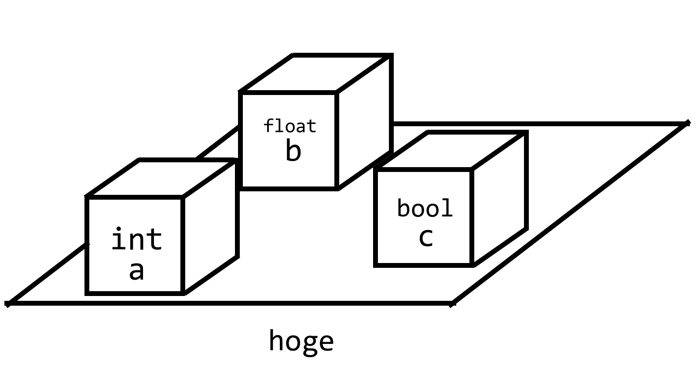

# C++講習 第4回 ~配列，構造体，クラス
## 配列
変数をつなげて扱えるようにしたものを，**配列**といいます．  


### 宣言
まずは例を見てみましょう．上の図は，以下のコードで表せます．
```cpp
int a[4];
```
`a`は配列名で，`[4]`は箱の個数です．一つひとつの箱のことを**要素**といいます．配列は，配列の名前と個数を`型 配列名[要素の個数];`で宣言します．

### 代入
配列の要素に値を代入したいとき，次のようにします．
```cpp
a[2] = 6;
```
  

箱の番号のことを，**添字**または**インデックス**といい，配列名に角カッコ`[]`をつけて表します．宣言時には要素の個数で宣言したのに対し，**添字は`0`から始まるので注意が必要**です．あとは普通の変数とまったく同じように使うことができます．

### 初期化
初期化時のみ，すべての要素に一括で代入することができます．
```cpp
int a[4] = {3, 4, 8, 9};
```
宣言と同時に初期化するとき，要素の個数を省略することができます．このとき，要素数は自動で確定します．
```cpp
int a[] = {3, 4, 8, 9};
```
### 添字を変数にする
添字に変数を使うことで，効率的にコードを書くことができます．例えば，`for`文を用いると，
```cpp
int a[10] = {1, 2, 3, 4, 5, 6, 7, 8, 9, 10};
for(int i = 0; i < 10; i++){
    a[i] = 2 * a[i];
}
```
のように，配列内のすべての要素を2倍するようなコードを簡単に書くことができます．

### n次元への拡張


配列はn次元に拡張することができます．例えば，2x2の配列を作りたい場合には
```cpp
int b[2][2];
b[0][0] = 1;
b[0][1] = 2;
b[1][0] = 3;
b[1][1] = 4;
```
のようにすることができます．また，初期化時には
```cpp
int b[][] = { {1,2},
              {3,4} };
```
のようにすることもできます．2次元に限らず，任意のn次元に拡張することができます．

### 文字列
文字を配列にしたものを，**文字列**といいます．文字列は以下のように特殊な初期化ができます．
```cpp
char s[] = {'h','e','l','l','o'};   //これと
char t[] = "hello";               //これは同じ
```
文字列は，**文字列関数**と呼ばれる便利な関数が多くあります．ここでは扱いませんが，興味のある人は調べてみてください．

## 構造体
配列で変数をまとめたあとは，必ずこう思うと思います．*「他の型のデータもまとめて扱えないかな？」* と．**できます．** 構造体を用います．

### 概念
**構造体**は，複数の型の変数をまとめて扱えるようにしたものです．
  
上の図は以下のコードで表せます．
```cpp
struct hoge{
    int a;
    float b;
    bool c;
};

int main(){
    hoge foo;
    foo.a = 1;
    foo.b = 3.8;
    foo.c = 0;
    printf("%d, %f, %d", foo.a, foo.b, foo.c);
}
```
構造体は**データのフィールドのようなもの**です．構造体は`struct`を用いて宣言し，宣言した型を用いて**実体化**します．上の例では，`hoge`という名前の型を定義し，`foo`という名前の実体を生成しています．

### メンバ
構造体の中のそれぞれの要素のことを**メンバ**といいます．それぞれのメンバには，`実体名.メンバ名`でアクセスします．それぞれのメンバは変数と同じように扱うことができます．

### 初期化
配列と同じように，初期化時のみ一気に代入することができます．
```cpp
hoge foo = {1, 3.8, 0};
```

## クラス
配列で異なる型の変数をまとめたあとは，必ずこう思うと思います．*「関数もまとめて扱えないかな？」* と．**できます．** クラスを用います．

### 概念
**クラス**は，複数の型の変数と関数をまとめて扱えるようにしたものです．
  
上の図は以下のコードで表せます．
```cpp
class hoge{
    public:
        int a;
        float b;
        int func(int x){
            return 2 * x;
        }
};

int main(){
    hoge bar;
    bar.a = 1;
    bar.b = 3.4;
    printf("%d\n", bar.func(5));
}
```
クラスは**データと関数のフィールドのようなもの**です．クラスは`class`を用いて宣言し，宣言した型を用いて実体化します．クラスの実体一つひとつのことを**インスタンス**といい，実体化することを**インスタンス化する**といいます．上の例では，`hoge`という名前の型を定義し，`bar`という名前のインスタンスを生成しています．

### メンバ変数とメソッド
クラスの中のそれぞれの変数のことを**メンバ変数**といいます．また，関数のことを*メンバ関数*といいたいところですが**メソッド**といいます．それぞれのメンバには，`インスタンス名.メンバ変数名`や`インスタンス名.メソッド名`でアクセスします．それぞれのメンバ変数やメソッドは普通の変数や関数と同じように扱うことができます．

### 問題
x, y, add()というメンバを持つクラスを作成し，値を代入して表示してください．add()という関数は1つの引数をとり，4を足した値を返してください．

### 初期化
初期化時のみ，配列や構造体と同じように一気に代入することができま……せん！ですが，**コンストラクタ**という特別な関数を使うことで，近いことを実現できます．

### コンストラクタ
コンストラクタは，**インスタンス化する際に必ず1度だけ呼び出される特別な関数**です．具体的な例で説明します．
```cpp
class hoge{
    public:
        int a;
        float b;
        int func(){
            return a + b;
        }
        hoge(int x, float y){
            a = x;
            b = y;
        }
};

int main(){
    hoge bar = hoge(1, 3.4);
    printf("%d\n", bar.func());
}
```
上の例で，見慣れない関数がありますね．`hoge()`には，返り値の型がありません．クラスの中で，**返り値の型がなく，かつ関数名がクラス名と同じ関数**は，コンストラクタになります．コンストラクタは，インスタンス化するときのみ呼び出すことができます．ここでは`main()`内の1行目で呼び出しています．コンストラクタの中では，引数をそれぞれメンバ変数に代入しています．

#### 省略記法
コンストラクタの呼び出しは以下のように省略できます．
```cpp
hoge bar(1, 3.4);
```

#### コンストラクタ初期化子
上の書き方でもいいのですが，メンバ変数が多かったりすると行が増えてしまい大変です．そこで，**コンストラクタ初期化子**を用いるとさらに省略して書くことができます．  
基本は
```
代入するメンバ(引数)
```
という形で列挙していきます．上の例をこれで書き換えると
```cpp
class hoge{
    public:
        int a;
        float b;
        int func(){
            return a + b;
        }
        hoge(int x, float y): a(x),b(y){
            //関数の中身は空   
        }
};
```
となります．

#### メソッドの定義を移動する
メソッドの定義をクラス内で行ってもいいのですが，関数が長かったりすると可読性が落ちます．そこで，クラスの中ではプロトタイプ宣言のみをして，定義を移動することができます．上の例で，`func`関数の定義をクラス外で行うと以下のようになります．
```cpp
class hoge{
    public:
        int a;
        float b;
        int func(int x);
};

int hoge::func(int x){
    return 2 * x;
}
```
関数を定義する前に，これがクラスの中のメソッドであるということを明示するために`クラス名::`をつけます．

### アクセス指定子
クラスの中に`public:`という見慣れない記述があったと思います．これは**アクセス指定子**と呼び，クラス内のメンバのスコープを制限することができます．試しに`public`を`private`に変えてみてください．すると，`main`内からメンバにアクセスできなくなると思います．アクセス指定子には
- `public` - スコープが全範囲
- `private` - スコープがクラス内のみ
- `protected` - スコープがクラス内と継承先クラスのみ

の3種類があります．クラスの継承に関してはこの記事で扱いませんが，興味のある人は調べてみてください．

[第3回](3.md)　　　[ホーム](index.md)